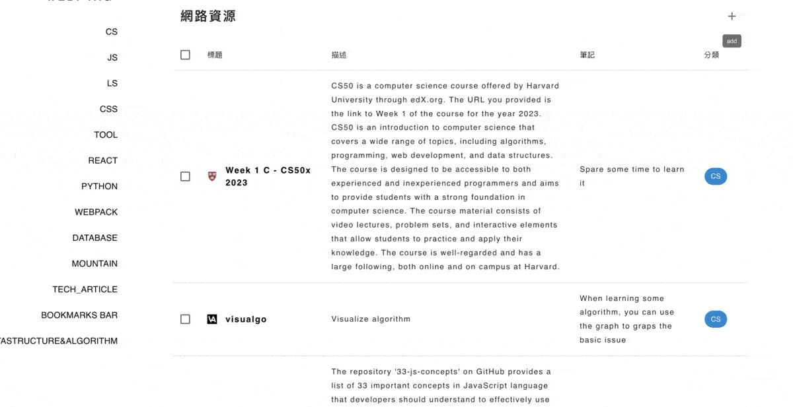

# A. Introduction

### a.1 ENV : React + Node.js + MUI

### a.2 Features

| I   | Features                                     |
| --- | -------------------------------------------- |
| 1   | Routing system to categorize bookmarks       |
| 2   | Add, create and edit the bookmarks           |
| 3   | Calling AI to fill the title and description |

### a.3 [DEMO](https://mybookmarksfront.vercel.app/)

# B. Getting Started

### Front :

| I     | SOP                                                                          |
| ----- | ---------------------------------------------------------------------------- |
| dev   | `yarn` -> `yarn start`                                                       |
| build | `yarn build` & revise `.env`, changing `REACT_APP_URL` to your server domain |

### Back :

| I     | SOP                                                                               |
| ----- | --------------------------------------------------------------------------------- |
| dev   | `yarn` -> `yarn watch`                                                            |
| build | revise your `.env`, changing `OPENAI_API_KEY` & `MONGO_URL` to your server domain |
